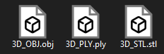

# CSV_Peek

👈*Download Here*

Peek inside csv files from `RenderDoc` to see the 3d mesh. Export it as three file types `.obj` `.ply` and `.stl`

- [Unzip]
- [command line] from the location of the script `python CSV_Peek-main.py` (opening the file by clicking on it works too)
- [load csv file and select the x y z settings]
- (optional) select export to save it as all three file types `.obj` `.ply` and `.stl`

